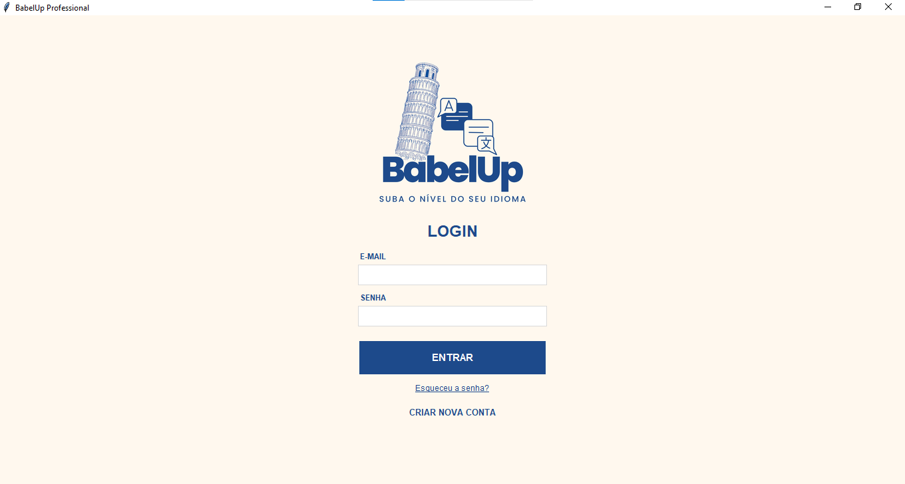
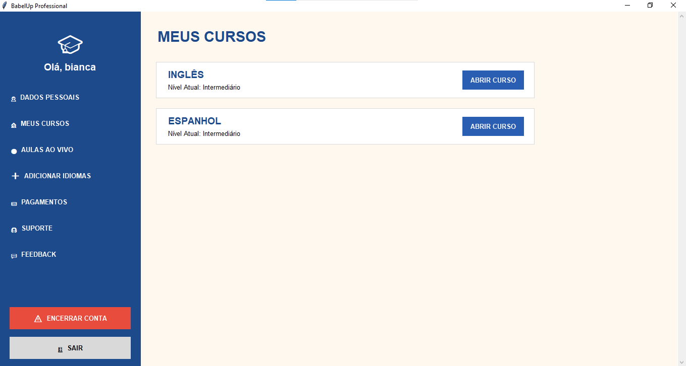
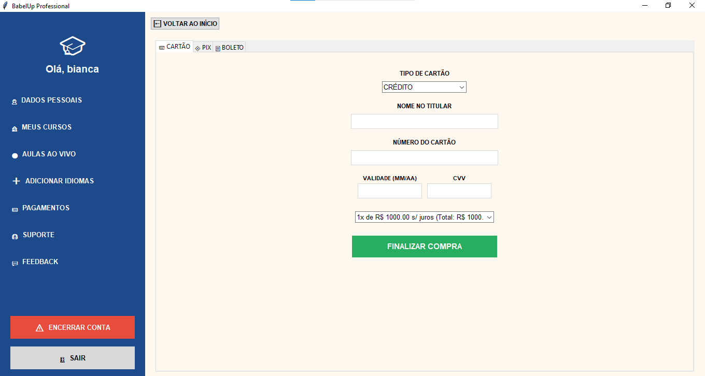

# 🌍 BabelUp - Sistema de Gerenciamento de Idiomas

**Aluna:** Bianca Oliveira  
**Curso:** Python

## 📝 Descrição do Sistema
O **BabelUp** é uma plataforma desktop para gerenciamento de cursos de idiomas. O sistema permite que alunos se cadastrem, escolham idiomas para estudo, progridam de nível e realizem a contratação de planos anuais com um sistema de checkout integrado.

## 🚀 Funcionalidades Principais
- **Sistema de Login e Cadastro:** Segurança e persistência de dados do usuário.
- **Catálogo Dinâmico:** Seleção de idiomas (Inglês, Espanhol, Francês).
- **Progressão de Nível:** Atualização em tempo real do nível do aluno no banco de dados.
- **Checkout Inteligente:** Cálculo de parcelamento com aplicação automática de juros de 3% para planos acima de 10 parcelas.
- **Gerenciamento de Conta:** Opção de encerramento de conta (Exclusão no banco de dados).

## 🛠️ Tecnologias Utilizadas
- **Linguagem:** Python 3.10+
- **GUI:** Tkinter
- **Banco de Dados:** SQLite3
- **Versionamento:** Git & GitHub

## 📸 Prints do Sistema

### 🔐 Tela de Login

### 📚 Área do Aluno (Meus Cursos)

### 💳 Checkout e Planos

## ⚙️ Como executar o projeto (Passo a Passo)

1. **Pré-requisitos:** Certifique-se de ter o Python instalado em sua máquina.
2. **Download:** Clone este repositório ou baixe os arquivos `main.py`, `banco.py` e a imagem `logo1.png`.
3. **Dependências:** O projeto utiliza bibliotecas padrão do Python (Tkinter e SQLite3), não sendo necessária a instalação de pacotes externos via pip na maioria das distribuições.
4. **Execução:**
   - Abra o terminal ou prompt de comando na pasta do projeto.
   - Digite o comando: `python main.py`
5. **Uso:** Realize o cadastro inicial para acessar as funcionalidades de compra e progresso.

---
*Projeto acadêmico desenvolvido para avaliação final.*
